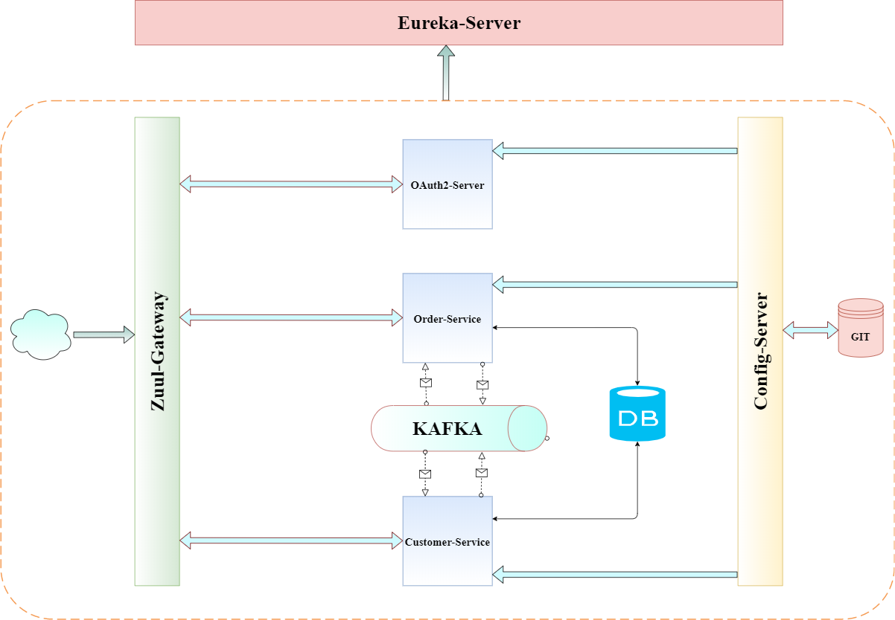
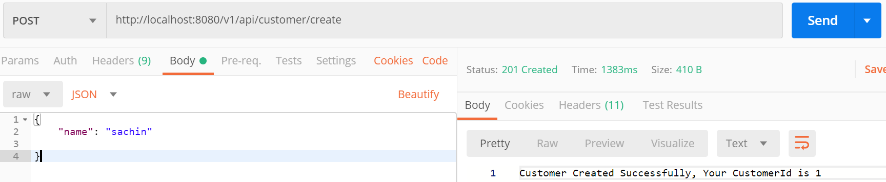
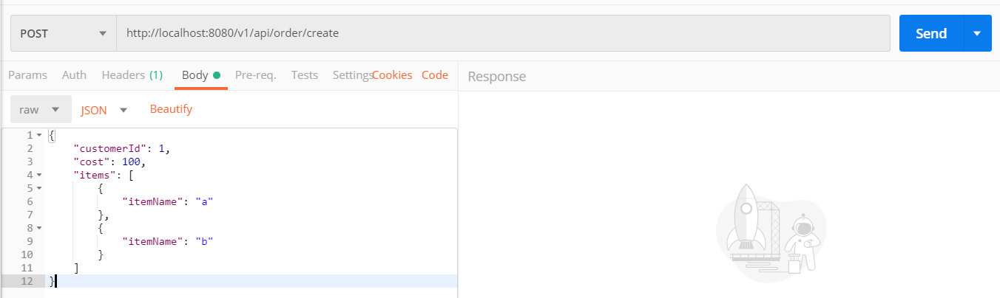
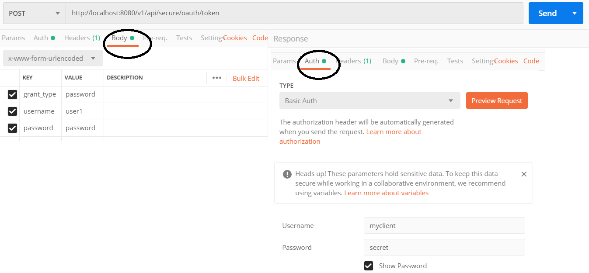
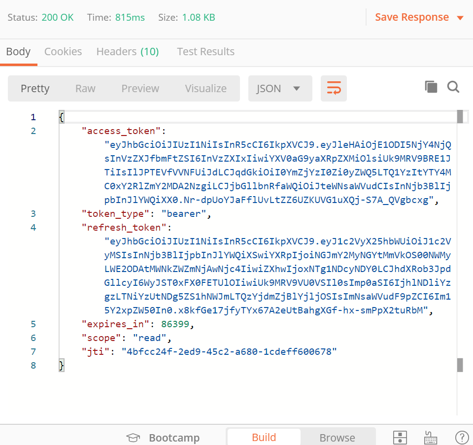
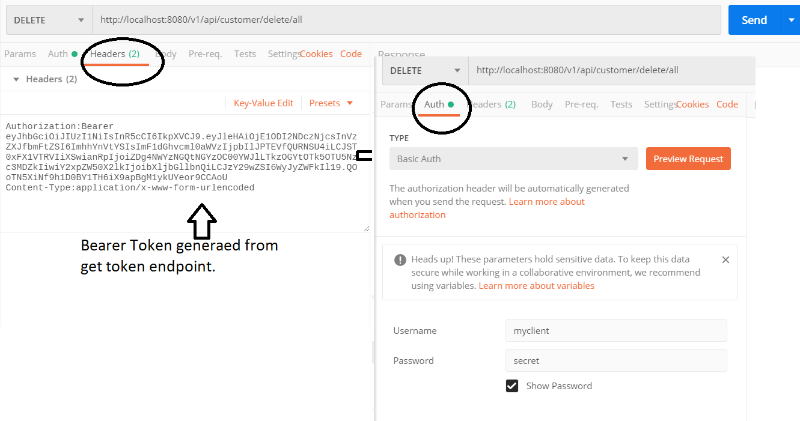

# Spring Boot MicroServices with AI-Powered DevSecOps

This repository combines a comprehensive Spring Boot microservices architecture with an AI-powered DevSecOps pipeline using AWS Bedrock for automated security analysis and deployment.

## 🏗️ Architecture Overview

```
┌─────────────────┐    ┌─────────────────┐    ┌─────────────────┐
│   Spring Boot   │───▶│   CI/CD Pipeline│───▶│   AWS Bedrock   │
│   Microservices │    │ (GitHub Actions)│    │   AI Security   │
└─────────────────┘    └─────────────────┘    └─────────────────┘
                                │
                                ▼
                       ┌─────────────────┐
                       │   AWS EKS       │
                       │   Microservices │
                       │   Deployment    │
                       └─────────────────┘
```

## 🚀 Features

### Microservices Architecture
- 🤖 **AI-Powered Security Scanning** using AWS Bedrock
- 🚀 **Automated CI/CD Pipeline** with GitHub Actions
- 🛡️ **Multi-layer Security** (SAST, DAST, Container Scanning)
- 📊 **Infrastructure as Code** with Terraform
- 🔍 **Compliance Monitoring** with AWS Config
- 📈 **Observability** with CloudWatch and X-Ray
- 🐳 **Container Orchestration** with EKS

### Spring Boot Services
- **Config Server**: Centralized configuration management
- **Eureka Server**: Service discovery and registration
- **OAuth2 Server**: Authentication and authorization
- **Zuul Gateway**: API gateway and routing
- **Customer Service**: Customer management microservice
- **Order Service**: Order processing microservice

## 📋 Contributors

* [Sachin Sachdeva](https://www.linkedin.com/in/sachin-sachdeva-70896120/)

## 🏗️ Application Architecture



## 📊 Project Overview

* This project mocks an e-commerce API where you can create customers and orders
* Customers can place orders with multiple products
* Uses Kafka broker for inter-service communication
* Integrated with AI-powered security analysis pipeline

## 🚀 How To Run

### Option 1: Traditional Docker Setup
```bash
# Install latest version of Docker
# Clone this GIT repository
# Go to directory `spring-boot-microservice` on your system
docker-compose up --build
docker-compose up
```

### Option 2: DevSecOps Pipeline (Recommended)
```bash
# Prerequisites
- AWS CLI configured
- Terraform >= 1.0
- Docker
- kubectl
- Node.js 18+

# Setup
git clone <repository>
cd AIOps

# Install dependencies
npm install

# Configure AWS credentials
aws configure

# Deploy infrastructure
cd infrastructure
terraform init
terraform plan
terraform apply

# Deploy microservices to EKS
kubectl apply -f k8s/
```

## 🌐 REST Endpoints

* **Create Customer**: `http://localhost:8080/v1/api/customer/create`
  

* **Create Order**: `http://localhost:8080/v1/api/order/create`
  

* **Get OAuth Token**: `http://localhost:8080/v1/api/secure/oauth/token`
  
  
  Response:
  

* **Delete All Customers**: `http://localhost:8080/v1/api/customer/delete/all`
  

## 🛡️ Security Features

- **SAST**: Static Application Security Testing
- **DAST**: Dynamic Application Security Testing
- **Container Scanning**: Image vulnerability scanning
- **Secrets Detection**: AI-powered secret scanning
- **Compliance**: SOC2, PCI-DSS, HIPAA checks
- **Runtime Protection**: Real-time threat detection

## 📊 Monitoring & Observability

- **Metrics**: CloudWatch dashboards
- **Logs**: Centralized logging with CloudWatch Logs
- **Tracing**: AWS X-Ray distributed tracing
- **Alerts**: Proactive monitoring and alerting

## 📁 Project Structure

```
├── .github/workflows/          # CI/CD pipelines
├── infrastructure/             # Terraform IaC
├── microservices/             # Sample microservices
├── security/                  # Security scanning tools
├── monitoring/                # Observability configs
├── scripts/                   # Utility scripts
├── docs/                      # Documentation
├── config-server/             # Spring Config Server
├── eureka-server/             # Netflix Eureka
├── oauth2-server/             # OAuth2 Authorization Server
├── zuul-server/               # API Gateway
├── customer-service/          # Customer Management
├── order-service/             # Order Processing
└── admin-server/              # Admin Dashboard
```

## 🤝 Contributing

1. Fork the repository
2. Create a feature branch
3. Make your changes
4. Run security scans (automated via CI/CD)
5. Submit a pull request

## 📄 License

MIT License - see LICENSE file for details.
